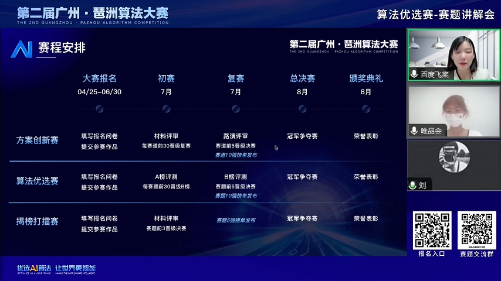

# recom_exp

## 赛题讲解

### 赛题介绍

本质上是一个CVR预估问题，以用户转化率为目标；已知：用户一个月的历史行为，商品属性；预测：用户在下一天购买的商品集合。

#### 训练集

用户行为数据，商品属性数据；大促前一个月的数据；

#### 测试集

用户id数据，商品id数据；大促当天的数据；

#### 提分策略

1.测试集为T+1天，即大促首日（618/双11/双12）数据，可以结合自己在大促前和大促当日行为特点进行思考；
2.仔细分析数据，洞察业务；
3.F1值，注意平衡精确率和召回率

具体哪天大促，建议看数据；

Baseline同样的开源地址更新。

### 结果评价

根据用户id，推测商品id数据集中有没有购买的商品，如果要购买的话，购买的是哪一个或哪几个；

对预测结果的集合，精确率和召回率都需要进行考虑；

商品候选集不是召回后的，是跟训练集同分布的数据；

#### 评价指标F1

$Precision=\frac{|\cap(PreditionSet,ReferenceSet)|}{|PreditionSet|}$

$Recall=\frac{|\cap(PreditionSet,ReferenceSet)|}{|ReferenceSet|}$

$F1 = \frac{2*Precision*Recall}{Precision+Recall}$

*建议：先对用户进行购买预测，再进行召回排序*

#### 提交要求

1.提交一份csv文档作为结果，文档名为u21.csv，并压缩为zip文件：
2.输出结果包含两列，分别是user_id和goods_id，英文逗号分隔；
3.user_ld只包括选手预测有购买行为的用户id，如认为用户无购买行为，则不需要包含该用户；
4.预测—个用户购买多个goods_1d时，写作多行；

### 问答

Q1：一定要用Paddle吗？是否能用lgb?

使用Paddle是评奖的前提。

Q2：可以用scikit-learn吗？如果用传统机器学习算法，不涉及深度学习，是不是也可以不用paddle框架？

特征选择和融合可以自由选择。

Q3: embedding可以用外部或开源模型生成吗？

是的。

Q4：过程

先提交A榜提交截止时间，选前30进入B榜；限制每天只能提交三次；前10名要Review代码；

