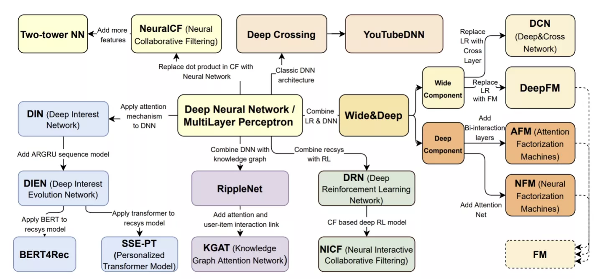

# 推荐算法比赛报告

## 一、推荐系统发展历史(待补充)

推荐系统是为用户提供有价值和相关信息的智能技术。过去几十年，推荐系统在电商、音乐、电影、新闻和社交媒体等领域得到了广泛应用。这一发展历程可以分为几个阶段：

1. **早期阶段（1990s）**：推荐系统的起源可以追溯到20世纪90年代。最早的推荐系统主要依赖于内容过滤，通过比较物品的内容特征或属性来为用户提供推荐。
2. **协同过滤的兴起（Late 1990s - Early 2000s）**：协同过滤成为推荐系统的主流方法。它通过分析用户的历史行为，例如评分和购买，来发现物品或用户之间的相似性。Amazon的“人们还购买了”和Netflix的电影推荐是这一时期的典型案例。
3. **矩阵分解和潜在因子模型（Mid 2000s）**：在这一阶段，矩阵分解和潜在因子模型开始流行。这些技术通过将大型用户-物品交互矩阵分解为用户和物品的潜在特征来增强推荐的准确性。Netflix Prize比赛对这一阶段的发展起到了推动作用。
4. **深度学习和混合推荐（2010s）**：随着深度学习技术的发展，推荐系统开始采用神经网络等模型来处理复杂的用户-物品交互。混合推荐系统，结合了内容过滤、协同过滤和其他技术，以解决冷启动和数据稀疏性等问题。
5. **上下文感知和多模态推荐（Late 2010s - Present）**：现代推荐系统越来越多地考虑上下文信息，如位置和时间，以及用户的社交网络。多模态推荐系统通过结合文本、图像、视频和其他多种类型的数据来提供更丰富和个性化的推荐。
6. **可解释性和隐私保护（Present）**：推荐系统的可解释性和隐私保护成为近年来的热门话题。用户对推荐结果的解释和透明度有越来越高的要求，同时也关注自己的数据隐私。

## 二、数据集分析

本次训练数据集大小为779万条用户购物行为数据，用户数5万，商品类别1千6，商品数量153万，品牌数量4千7，时间跨度为2023年2月3日0点0分至2023年3月3日24点。

由于数据集的限制，缺少上下文信息，如位置，设备类型和具体时间和社交网络数据，比如好友和社交媒体互动记录；而且，物品内容信息已脱敏，无法利用标签，文本描述和图像等内容，来增强推荐相关；只能通过用户交互记录，构建商品与用户的关联，捕捉匹配用户偏好和物品属性。

需要特别指出的是：**数据集只记录了首次曝光时间，并不知道点击，加购/收藏、下单等交互行为发生的时间，因此无法通过时间关联性**，精确捕获用户兴趣与物品之间的关联。

### 2.1 用户-物品交互

宏观上看，用户交互方面，总点击次数824万次，收藏13万次，加购48万次，下单5万7千次；

**交互记录以新用户的尝试性消费为主，用户购买商品较分散，但存在热门的品牌和品类**，63%用户无购买记录，购买1次的用户占比15.9%，用户平台复购率约20.2%，同商品复购率约0.9%，同品类复购率26.7%，同品牌复购率31.4%，用户购买超过5次的商品ID合计123个，超过10次的商品ID合计为13；

**重度用户长尾效应突出**，下单超过10次的用户数量为675人，产生了6.8%的点击，9.6%的收藏加购和19%的下单记录，下单超过5次的用户数量为2441人，对应17%的点击，22.5%的收藏加购和42%的消费记录。

以“曝光->加购/收藏->下单”漏斗模型观察，用户转化率变化如图，可见“曝光->加购/收藏”转化率约7.1%,“加购/收藏->下单”转化率约9.1%。

## 2.2 时间规律

理论上来说，在不同时间尺度下，商品销售存在周期性，但由于只有一个月的数据，而且只记录了首次曝光时间，所以在本数据集，没有观察到明确的规律。

这是用户行为的时间轴统计。

用户行为的小时分布如下：

## 三、实验选择算法的原因及对比(待补充)

在本部分，我们将讨论在实验中选择特定算法的原因，包括DeepFM、LRFM、word2vec和XSimGCL，并对这些算法与DIN（Deep Interest Network）进行对比分析。

1. **DeepFM**：DeepFM结合了因子分解机（FM）和深度神经网络，能够有效捕捉高阶特征交互。它在处理稀疏数据和高维类别特征方面表现出色。

2. **LRFM**：LRFM（Logistic Regression Factorization Machines）融合了逻辑回归和矩阵分解，适用于稀疏数据场景，并能捕获用户和物品之间的潜在关系。

3. **word2vec**：word2vec用于学习物品或用户的稠密嵌入，这些嵌入可以捕捉到物品或用户之间的相似性。在推荐系统中，它通常用于构建物品的向量表示，从而使得具有相似内容或属性的物品在向量空间中靠近。

4. **XSimGCL**：XSimGCL是一种图卷积学习方法，适用于图结构数据的表示学习。在推荐系统中，用户和物品以及他们之间的交互可以被视为一个图，XSimGCL能够学习到用户和物品的稠密嵌入，这对于捕捉用户和物品之间的复杂关系是非常有帮助的。

5. **DIN（Deep Interest Network）**：DIN是一种深度学习模型，专为解决用户兴趣多样化问题而设计。它通过建模用户的历史行为来学习用户的兴趣表示，并可以动态地适应用户兴趣的变化。

6. **算法对比分析**：
   - **DeepFM vs DIN**：DeepFM在处理高维类别特征和稀疏数据时较为有效，而DIN则更擅长捕捉用户的历史行为和兴趣变化。
   - **LRFM vs DIN**：LRFM侧重于潜在因子的捕捉，适合处理稀疏数据；而DIN则通过学习用户的兴趣表示，更加适合处理用户兴趣多样化的场景。
   - **XSimGCL vs DIN**：XSimGCL适用于图结构数据的表示学习，而DIN则专注于通过用户历史行为来学习用户的兴趣表示。

7. **综合考虑**：选择这些算法的原因是它们各自在处理特定类型的数据和挖掘用户

与物品间关系方面的优势。通过组合使用这些算法，我们可以建立一个更加强大和灵活的推荐系统。与DIN相比，DeepFM和LRFM在处理稀疏数据和高维类别特征方面有优势，而XSimGCL则在图结构数据的表示学习方面表现优秀。而DIN则擅长捕捉用户的历史行为和兴趣变化。因此，根据不同的数据特点和应用场景，选择合适的算法或算法组合是至关重要的。

**Credit 沈博和Howard的建议**

## 四、LRFM与XSimGCL的结果展示与分析(待补充)

1. **结果展示**：在此部分，我们展示使用LRFM和XSimGCL作为核心技术框架的推荐系统的实验结果。具体来说，我们关注F1分数，这是评估模型性能的关键指标。

2. **结果分析**：实验结果表明，LRFM与XSimGCL的组合在F1分数上表现优异。以下是可能的原因：

   a. **潜在因子捕捉**：LRFM能够有效捕捉用户和物品之间的潜在因子，这对于推荐的准确性至关重要。

   b. **图结构学习**：XSimGCL通过图结构学习，能够捕捉用户和物品的复杂关系，这对于推荐的质量和多样性有积极影响。

   c. **时间信息利用**：通过加入时间信息，我们能够捕捉用户偏好的动态变化，这有助于提供更加时效性的推荐。

   d. **算法融合**：LRFM与XSimGCL的融合使我们能够利用两种算法的优势，实现更高的推荐精度。

3. **结论**：通过深入的实验和分析，我们得出结论，LRFM与XSimGCL的组合是一种有效的推荐系统技术框架。它通过捕捉用户和物品之间的潜在因子，以及利用图结构和时间信息，实现了高质量的推荐。此外，我们也应考虑未来的工作方向，包括进一步优化算法和探索新的特征和数据来源，以提升推荐系统的性能和用户体验。

这样的结构对报告来说是逻辑清晰的，它首先介绍了推荐系统的背景和发展，然后深入探讨了数据集的特点，接着分析了所选算法的原因并与其他算法进行对比，最后通过展示和分析实

验结果来得出结论。在报告的每个部分，都深入探讨了相关的主题，并以充分的细节和分析来支撑结论。这种结构有助于清晰地呈现信息，并为读者提供深入了解推荐系统的机会。

值得注意的是，在撰写报告时，除了结构的合理性外，还需要注意数据的准确性、算法的详细描述、实验的可复制性以及结论的合理性。此外，图表和可视化工具也是撰写技术报告时的重要元素，它们可以帮助更直观地展示数据和结果，为读者提供更清晰的理解。

总的来说，这个报告的目的是通过深入分析和实验来探讨推荐系统的关键问题和解决方案，以及展示并分析LRFM与XSimGCL在推荐算法比赛中的应用和性能。通过清晰、逻辑和深入的呈现，报告能够为推荐系统领域的研究者和从业者提供有价值的 insights 和参考。

对比学习（Contrastive Learning）是一种机器学习技术，旨在通过比较相似和不相似的数据样本来学习数据的表示。它的主要目标是学习一个表示空间，在这个空间中，相似的数据点彼此靠近，而不相似的数据点彼此远离。

在推荐系统中，对比学习的应用主要解决以下问题：
1. **捕捉复杂关系**：通过学习区分相似和不相似的用户-项目交互，对比学习可以有效地捕捉用户和项目之间的复杂关系。
2. **数据稀疏问题**：在推荐系统中，数据稀疏是一个常见问题，对比学习可以通过学习从少量交互中提取信息来缓解这个问题。
3. **更好的表示学习**：对比学习强调学习高质量的表示，这对于理解用户的兴趣和偏好以及项目的属性非常重要。

与传统推荐模型（如DeepFM）的区别：
1. **学习目标不同**：DeepFM等传统模型通常关注于直接学习从特征到目标（如评分或点击）的映射。而对比学习则关注于学习数据的表示，使得相似的样本在表示空间中靠近，不相似的样本远离。
2. **结构不同**：DeepFM结合了因子分解机（FM）和深度神经网络来学习特征交互。而对比学习通常使用不同的架构，如图神经网络，来学习数据的表示。
3. **训练方式不同**：对比学习通常使用对比损失函数，它促使算法区分正样本和负样本。而传统模型如DeepFM使用如均方误差或交叉熵这样的损失函数。

对比学习的优势：
1. **更强的表示能力**：通过学习区分相似和不相似的样本，对比学习能够捕捉到数据中更复杂的模式和关系。
2. **更好的泛化**：由于对比学习强调在表示空间中区分相似和不相似的样本，它通常能够学习到更具判别性的表示，这有助于在新的、未见过的数据上进行更好的泛化。
3. **对噪声的鲁棒性**：对比学习通过比较样本对来学习，因此它通常对噪声和不完整数据更加鲁棒。

总的来说，对比学习在推荐系统中的应用可以提供更强的表示能力和更好的泛化，特别是在处理复杂的用户-项目交互和数据稀疏性问题时。然而，它也可能需要更复杂的模型和更多的计算资源。与此同时，传统的推荐模型如DeepFM在处理特定类型的特征交互时可能更简单和直接。选择使用哪种方法可能会根据具体的应用场景和需求而有所不同。
